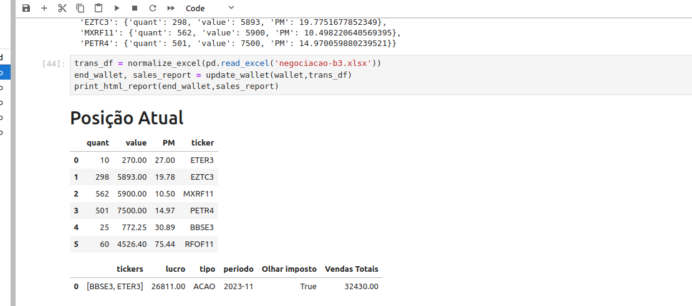

# Objetivo

É um script simples usando Pandas/Jupyter/Python para gerar as informações necessárias para o imposto de renda.
Pode ser editado para atender as necessidades individuais de cada um.
A idéia é processar as negociações feitas durante o período a ser analisado, e informar a posição acionária no final do período
com o preço médio de cada ação e se alguma operação de venda durante o período precisa ter imposto pago via DARF.

# Requisitos técnicos
O uso desse script é indicado pra quem já tem alguma familiaridade com python/jupyter.
Primeiro precisa do python >= 3.10 instalado.
Instalar as dependencias ```pip install -r requirements.txt```

# Como Usar

1. Para utilizar o script, é necessário preencher a planilha posicao_anterior.xlsx com a sua posição de ações/FII/ETF no final do ano anterior. Importante notar que o valor indicado na planilha é sempre é o valor de compra.
2. Baixar o relatório de negociação na B3 para o período a ser analisado (pode ser do ano, ou do mês por exemplo, se for só pra acompanhar as posições). Nomear esse relatório em excel para negociacao-b3.xlsx
3. Rodar ```jupyter lab```na linha de comando e abrir o arquivo calculo_ir.ipynb
4. Executando os blocos (Shift+Enter) já deve ter o resultado calculado

# Disclaimer
Use por sua conta e risco. Só estou comparilhando o que me ajuda com meu imposto.

# Pegadinhas já identificadas

## Desdrobramentos / Splits / Bonificações
Nesses casos, não aparece nada no relatório da B3. O jeito mais fácil de adaptar nesses casos é colocando linhas de valor 0 manualmente no relatório da B3.

1. Por exemplo, um split que suas 1000 ações de XPTO3 viraram 2000 ações de XPTO3, pode ser registrado na planilha como:
Compra de 1000 ações XPTO3 com Valor R$ 0
2. Para bonificações, 1 ação para cada 100 por exemplo, também pode ser inserido um registro com valor 0, com a quantidade de ações a mais recebidas.

## Agrupamentos
Para agupamentos, não funciona a mesma estratégia de mexer na planilha de negociações. O ideal é alterar a quantidade na planilha de posição inicial.
Ou registrar uma venda no mesmo valor de compra de tudo, e registrar uma compra com o valor novo por ação. Embora isso bagunce o resultado das vendas no mês.

1. Por exemplo para agrupamento, 1000 ações XPTO3 compradas a R$ 10,00 cada viraram 100 ações XPTO3.
2. Registra-se manualmente uma venda de 1000 ações XPTO3 com valor R$ 10.000,00 total.
3. Registra a compra de 100 ações XPTO3, com valor por ação de 100. Ou seja, também R$ 10.000,00 total.

# O que você deve ver?
